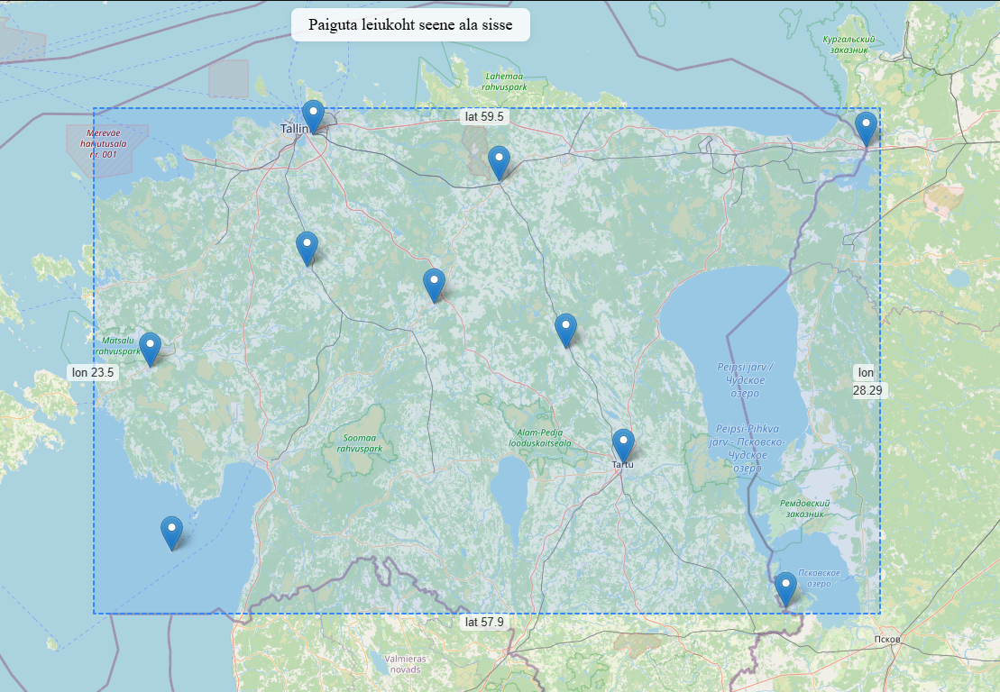

# Seene leiukohtade kaardirakendus



## Kirjeldus

See rakendus võimaldab hallata ja visualiseerida seente leiukohti Eesti territooriumil. Rakendus koosneb Java Spring Boot backendist ja Leaflet.js põhjal tehtud lihtsast front-endist. Kõik leiukohad salvestatakse PostgreSQL/PostGIS andmebaasi ning andmevahetus toimub GeoJSON formaadis.

## Käivitusjuhend

1. **Nõuded:**
   - Java 17 või uuem
   - PostgreSQL koos PostGIS extensioniga
   - Node.js (ainult kui soovid frontendi arendada, tavalise kasutuse jaoks pole vaja)

2. **Andmebaasi seadistamine:**
   - Loo andmebaas `mushroom`.
   - Käivita fail `src/main/resources/schema.sql` (vajadusel käsitsi), et luua vajalik tabel ja PostGIS extension.

3. **Konfigureeri ühendus:**
   - Failis `src/main/resources/application.properties` määra PostgreSQL kasutajanimi ja parool.

4. **Käivita rakendus:**
   - Terminalis projekti kaustas:
     ```
     ./gradlew bootRun
     ```
   - Rakendus käivitub vaikimisi aadressil [http://localhost:8080](http://localhost:8080)

5. **Ava veebirakendus:**
   - Ava brauseris `http://localhost:8080`.

## Kasutusjuhend

- Kaardil kuvatakse kõik olemasolevad seene leiukohad markeritena.
- Uue leiukoha lisamiseks klõpsa kaardil soovitud kohas ning sisesta kirjeldus.
- Leiukoha lisamine on lubatud ainult "seene ala" (sinine kast) sees. Ala piirid on kaardil näha ning servades on koordinaadid.
- Markerile liikudes kuvatakse koordinaadid ja kirjeldus.
- Kõik andmed salvestatakse andmebaasi ja on nähtavad kõigile kasutajatele.

## Exceptionid

1. **Koordinaadid väljaspool lubatud ala**
   - Kui kasutaja proovib lisada või muuta leiukohta, mille koordinaadid jäävad väljapoole lubatud ala, viskab backend exceptioni:
     ```
     Koordinaadid peavad jääma seene ala sisse.  lon >= 23.5 && lon <= 28.29 && lat >= 57.9 && lat <= 59.5
     ```
   - Frontendis kuvatakse toast-teavitus.

2. **Leiukohta ei leitud (ID puudub)**
   - Kui proovida muuta leiukohta, mida andmebaasis pole, viskab backend exceptioni:
     ```
     ID-ga {id} asukohta ei leitud.
     ```
   - Tagastatakse HTTP 404 vastus.

## API testimine ja Postman Collection

- Kaasas on Postman Collection fail `Seene API.postman_collection.json`, millega saab testida kõiki API otspunkte (GET, POST, PATCH, DELETE).
- Ava Postmanis ja määra muutuja `baseURL` väärtuseks `http://localhost:8080`.

---

Kui vajad abi või tekib küsimusi, võta julgelt ühendust!
